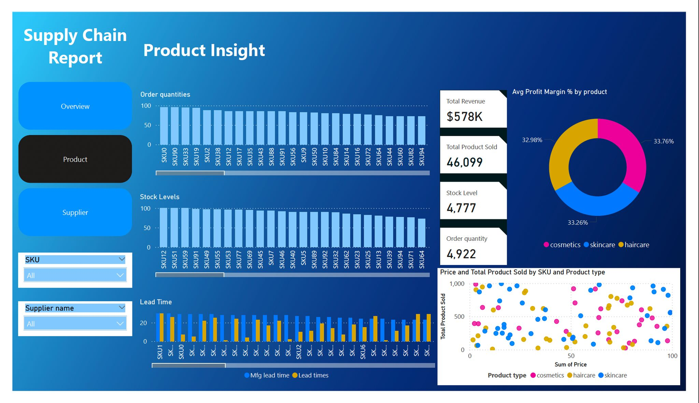
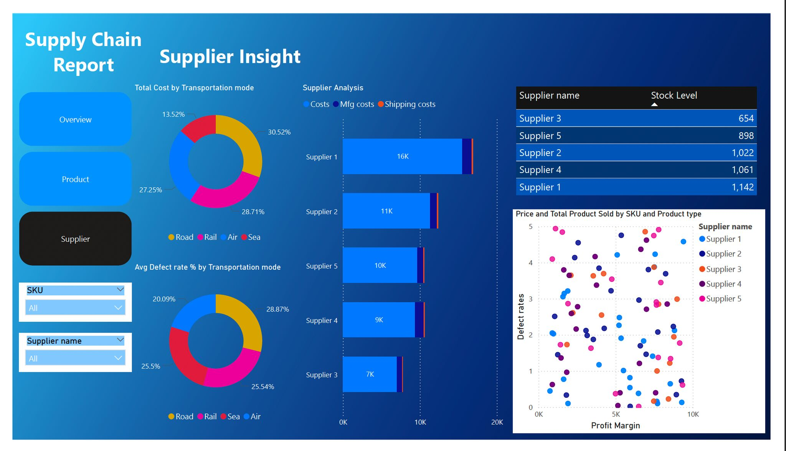

# 📊 Supply Chain Analytics – Power BI Dashboard

> **Transforming raw supply chain data into powerful, interactive business insights**


---

## 🔍 Project Overview

This Power BI project analyses supply chain data across three interconnected dashboards — providing a 360° view of financial performance, product trends, and supplier efficiency. Built with a focus on clean data transformation, robust DAX measures, and intuitive visual storytelling.

---

## 📸 Dashboard Previews

### 1️⃣ Overview Dashboard

*High-level KPIs, revenue breakdown by demographics, product type, shipping carriers, and top SKU performance.*

### 2️⃣ Product Insight Dashboard

*Order quantities, stock levels, lead times, and profit margin breakdown across all product categories and SKUs.*

### 3️⃣ Supplier Insight Dashboard

*Supplier cost analysis, defect rates by transportation mode, stock levels, and profit margin comparison across suppliers.*

---

## 💡 Key Insights Uncovered

### 💰 Financial Overview
| Metric | Value |
|--------|-------|
| Total Revenue | $578K |
| Total Cost | $58K |
| Avg Profit Margin | **86.07%** |
| Total Products Sold | 46,099 |
| Stock Level | 4,777 units |

### 🛍️ Product Performance
- **Skincare** dominates revenue at **$0.24M**, followed by haircare ($0.17M) and cosmetics ($0.16M)
- **SKU51, SKU38, and SKU31** are the top revenue contributors (~$9.9K each)
- Avg Profit Margin is nearly equal across categories: cosmetics (33.76%), haircare (33.26%), skincare (32.98%)

### 🧑‍🤝‍🧑 Customer Insights
- **Female customers** generated the highest revenue (~30%)
- Revenue distributed across: Unknown (28.49%), Male (34.65%), Non-binary (20.15%)

### 🚚 Shipping Performance
- **Carrier B** leads shipping revenue at **$0.25M**
- Road transport is the costliest and shows the **highest defect rates** (28.87%)

### 🏭 Supplier Insights
- **Supplier 3** has the highest profit margin at **91.08%**
- **Supplier 1** holds the highest stock level (1,142 units)
- Supplier costs range from $7K (Supplier 3) to $16K (Supplier 1)

---

## ⚙️ Technical Implementation

### 🔧 Data Transformation (Power Query)
- Cleaned and standardised raw supply chain dataset
- Handled null values, data type corrections, and column renaming
- Merged and appended tables for a unified data model

### 📐 DAX Measures Built
```
Total Revenue = SUM(Sales[Revenue])
Total Cost = SUM(Sales[Cost])
Avg Profit Margin % = AVERAGE(Sales[Profit_Margin])
Stock Level = SUM(Inventory[Stock])
Order Quantity = SUM(Orders[Quantity])
Defect Rate % = AVERAGE(Supplier[Defect_Rate])
```

### 📊 Visuals Used
| Visual Type | Used For |
|-------------|---------|
| Card Visuals | KPI headline metrics |
| Donut Charts | Revenue by demographics & product category |
| Bar / Column Charts | Revenue by carrier, SKU, supplier cost |
| Scatter Plot | Price vs. products sold by SKU & product type |
| Tables | Supplier profit margins & stock levels |
| Slicers | Dynamic filtering by SKU and Supplier name |

---

## 🗂️ Dashboard Pages

| Page | Focus |
|------|-------|
| **Overview** | Business-wide KPIs, revenue trends, top SKUs, supplier margins |
| **Product Insight** | Order quantities, stock levels, lead times, margin by category |
| **Supplier Insight** | Cost analysis, defect rates, transport mode performance |

---

## 🛠️ Tools & Technologies

`Power BI Desktop` `Power Query` `DAX` `Data Modeling` `Data Visualization` `Data Cleaning`

---

## 📥 How to Use

1. Clone or download this repository
2. Open `Supply_Chain_Analytics.pbix` in **Power BI Desktop**
3. If needed, update the data source path under **Transform Data → Data Source Settings**
4. Explore the 3 interactive dashboard pages using the slicers (SKU, Supplier name)

---

## 📁 Repository Structure

```
supply-chain-analytics-powerbi/
│
├── README.md
├── Supply_Chain_Analytics.pbix
│
├── screenshots/
│   ├── Overview_dashboard.jpeg
│   ├── Product_insight.jpeg
│   └── Supplier_insight.jpeg
│
└── data/
    └── supply_chain_data.csv
```

---

## 👤 Author

**Kapil Gohane**
Data Analyst | MSc Engineering Management, University of Birmingham

[](https://linkedin.com/in/your-profile)
[](https://github.com/your-username)
[](mailto:kapilsudhakargohane2@gmail.com)

---

## 📌 Other Projects

| Project | Description | Link |
|---------|-------------|------|
| Dissertation – Industry 4.0 PM Framework | MSc research developing a hybrid Agile-Lean PM framework, awarded with Distinction | [View](#) |
| MIS Consulting Project | Manufacturing workflow optimisation using POTi framework | [View](#) |
| Business Operations Strategy – Bewild | Market expansion strategy for a forest-friendly produce startup | [View](#) |

---

> *"Good data tells a story. Great dashboards make that story impossible to ignore."*
